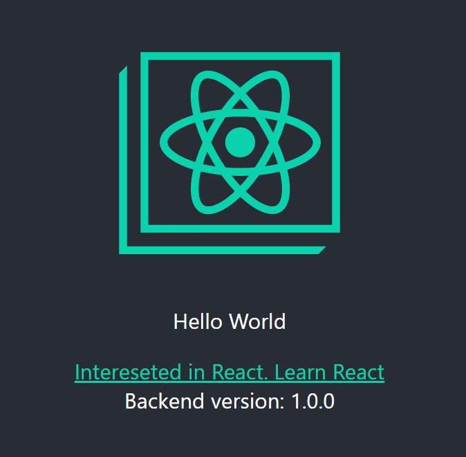
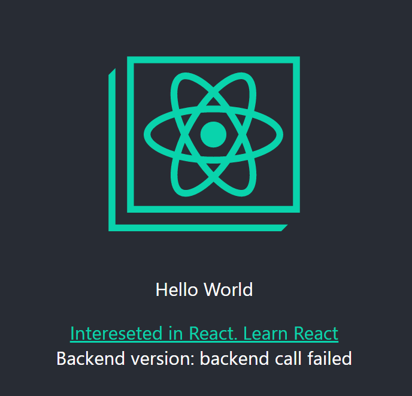

# example-app-frontend

This is a sample react frontend. It's running on port 3000 by default.
This project was bootstrapped with [Create React App](https://github.com/facebook/create-react-app) and displays the app version provided by the backend via an API.

The backend for this frontend can be found at: [https://github.com/hulk0301/example-app-backend](https://github.com/hulk0301/example-app-backend)

## Configuration

To ensure that the frontend uses the correct `backend` set the environment variable `API_URL`. The value must be a valid URL like `http://backend:8080`.

## Build on Docker

This folder contains a [Dockerfile](./Dockerfile). This can be used to build the application and bake it into an image.

## Run on Docker

Here is an example command to run the frontend on Docker(assuming backend is reachable via `backend` on port `8080`):

```sh
docker container run --name frontend -p 8080:3000 -e API_URL=http://backend:8080 -d frontend:v1.0.0
```

## Verify deployment

Access the frontend via the node's public IP and check if you can see the backend version, fetched from the backend.



### Backend connection failed

If you see an error message, check if you have set the environment variable `API_URL` to a valid url(backend) and the backend is reachable.


